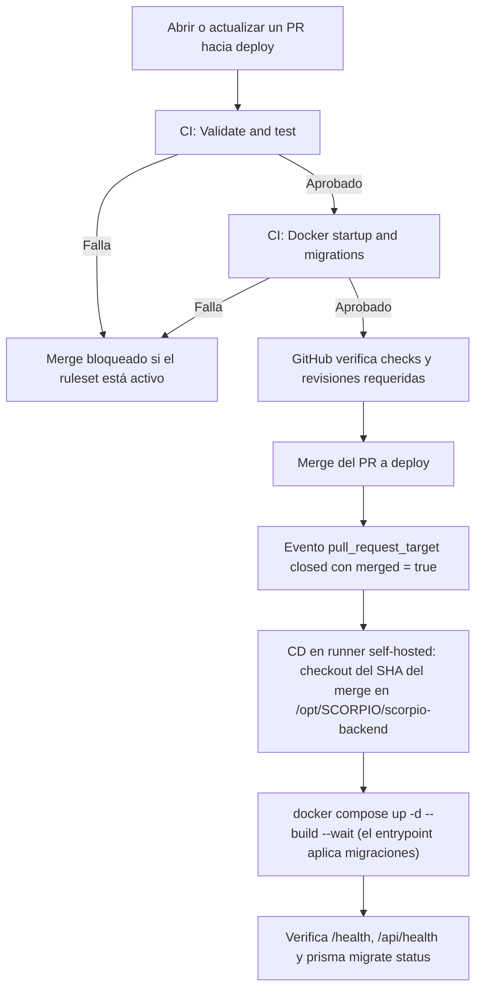

# CI y CD de SCORPIO

* CI: Validacion de esquemas de Prisma, instalacion de dependencias, y despliegue de contenedores Docker para pruebas de arranque y migraciones.
* CD: Al mergear un PR en `deploy`, despliega ese commit exacto en la VM (`/opt/SCORPIO/scorpio-backend`) con Docker Compose y verifica salud y migraciones.

## Responsabilidades

| Componente | Responsabilidad | Dónde corre |
| --- | --- | --- |
| [ci.yml](../.github/workflows/ci.yml) | Validar schema, compilar, probar y verificar el arranque Docker en PRs hacia `development`, `deploy` y `main` | Runners temporales `ubuntu-latest` de GitHub |
| Ruleset de `deploy` | Impedir merges sin PR y sin los checks requeridos | Configuración del repositorio en GitHub |
| [cd.yml](../.github/workflows/cd.yml) | Desplegar el commit del merge en la VM y verificar su salud al mergear un PR en `deploy` | Runner self-hosted `scorpio-backend-01` (label `scorpio-backend`) en la VM |

## Flujo hacia deploy



El flujo protegido depende de configurar el ruleset. Los YAML no crean esa regla. CD no consulta automáticamente el resultado de CI: lo dispara el merge del PR. Un push directo a `deploy` **no** dispara CD, pero sí cambia la rama; por eso el ruleset debe bloquear pushes directos para que la rama y lo desplegado no diverjan.

## CI: cuándo se ejecuta

- Solo en `pull_request` cuyo destino es `development`, `deploy` o `main`, en sus eventos predeterminados: apertura, actualización de commits y reapertura.
- No corre en pushes (tampoco tras el merge) ni de forma manual.

La validación ocurre en el PR antes del merge. No se ha configurado `merge_group`: si se adopta una merge queue, hay que agregar ese evento.

### Job 1: Validate and test

Se ejecuta con Node.js `22.12.0`, alineado con el Dockerfile, y un límite de 15 minutos.

| Paso | Qué verifica |
| --- | --- |
| Checkout | Obtiene el código correspondiente a la ejecución |
| `npm ci` | Instala las versiones del lockfile; usa caché de npm |
| `npx prisma validate` | Comprueba la validez del schema Prisma |
| `npx prisma generate` | Genera el cliente Prisma necesario para compilar |
| `npm run build` | Compila la API y verifica tipos TypeScript |
| `npm run build:seed` | Compila el seed; no lo ejecuta |
| `npm test` | Ejecuta las pruebas unitarias en `tests/*.test.cjs` |

La `DATABASE_URL` de este job es ficticia: estos pasos no necesitan conectarse a PostgreSQL. Los tests actuales simulan las dependencias y verifican el comportamiento de los jobs de satélites.

### Job 2: Docker startup and migrations

Solo comienza si el primer job pasa (`needs: validate`). Tiene un límite de 20 minutos y usa [docker-compose.ci.yml](../docker-compose.ci.yml).

1. Construye la imagen usando el Dockerfile real del backend.
2. Levanta PostgreSQL con almacenamiento temporal y credenciales exclusivas de prueba.
3. Arranca la API, cuyo entrypoint ejecuta `prisma migrate deploy` sobre esa base vacía.
4. Espera hasta 180 segundos a que los contenedores estén saludables.
5. Comprueba `/health` y `/api/health` desde el puerto publicado: exige éxito HTTP y JSON con `status: "ok"`.
6. Ejecuta `prisma migrate status` dentro del contenedor de la API.
7. Si falla, imprime estado y últimos logs. La limpieza está configurada con `if: always()` para retirar los recursos temporales al finalizar.

No se usan la base productiva, sus volúmenes, la VPN, la VM ni secretos de producción. No se llama a CelesTrak. El puerto del host se asigna automáticamente. La imagen se construye para la prueba, pero no se publica en un registro ni se transfiere a CD.

Estos checks prueban el arranque y las migraciones desde una base vacía. No garantizan que todas las rutas funcionen ni que una migración sea compatible con datos productivos existentes.

### Resultado de CI

Un resultado exitoso significa que pasaron las comprobaciones anteriores. Un error de comando detiene los pasos normales del job y lo marca como fallido. Las ejecuciones anteriores del mismo workflow y referencia se cancelan al llegar otra ejecución (`cancel-in-progress: true`).

Para reproducir los checks localmente, consultar [Test CI workflow](DEVELOPMENT.md#test-ci-workflow) o [Probar los workflows con act](#probar-los-workflows-con-act).

## Reglas de merge en GitHub

En Settings, crear o actualizar el ruleset dirigido a `deploy`:

- **Enforcement status: Active**.
- **Require a pull request before merging**.
- **Require status checks to pass**, seleccionando `Validate and test` y `Docker startup and migrations` tal como aparecen en GitHub.
- **Require branches to be up to date before merging**.
- **Required approvals** según el equipo: `1` requiere revisión de otra persona; `0` exige PR sin aprobación humana obligatoria.
- Mantener **Restrict deletions** y **Block force pushes** si esa es la política acordada, y limitar excepciones de bypass.

`Require code quality results` corresponde a otra funcionalidad de GitHub y no reemplaza los checks de nuestro CI. No se requiere `Require deployments to succeed` para este flujo, porque el despliegue previsto ocurre después del merge.

La activación real del ruleset se comprueba en GitHub; su existencia no se puede confirmar solo leyendo este repositorio.

## CD: despliegue en la VM

### Cuándo se ejecuta

- Con `pull_request_target` de tipo `closed` hacia `deploy` (ver [Seguridad](#seguridad-repos-públicos)). El job solo corre si `github.event.pull_request.merged == true`; un PR cerrado sin merge se omite.
- No se dispara con pushes directos a `deploy` ni permite ejecución manual.

### Dónde corre

En el runner self-hosted `scorpio-backend-01` (`runs-on: [self-hosted, scorpio-backend]`), instalado en `/opt/gh-runner/runner-scorpio-backend` como servicio systemd `actions.runner.scorpio-iotuc-scorpio-backend.scorpio-backend-01`. Corre con el usuario `gh-runner`, que pertenece a los grupos `docker` y `scorpio-local`.

El despliegue opera directamente sobre `/opt/SCORPIO/scorpio-backend`, el mismo directorio con el `.env` y `db_data/` de producción. Por eso:

- El repositorio debe ser escribible por el grupo `scorpio-local` (`chmod -R g+w`, excepto `db_data/`) y tener `core.sharedRepository=group`. Los pasos usan `umask 002` para que los archivos nuevos sigan siendo editables por el grupo.
- `gh-runner` no es dueño del directorio, por lo que el job declara `safe.directory` con variables `GIT_CONFIG_*`.
- **No se debe desarrollar en ese directorio.** Tras un despliegue queda en *detached HEAD* sobre el commit desplegado. Si hay cambios sin commitear en archivos versionados, CD falla en el primer paso en vez de sobrescribirlos. `.env` y `db_data/` están ignorados por git y no bloquean.

### Pasos

| Paso | Qué hace |
| --- | --- |
| Check deploy directory is clean | Falla si hay cambios sin commitear en archivos versionados |
| Fetch merged commit | `git fetch origin deploy` autenticado con el `GITHUB_TOKEN` del job (`contents: read`) y comprueba que `merge_commit_sha` pertenezca a `origin/deploy` |
| Check out merged commit | `git checkout --detach <merge_commit_sha>`: se despliega exactamente el commit del merge, no la punta de la rama |
| Build and start containers | `docker compose up -d --build --remove-orphans --wait --wait-timeout 300`. El entrypoint aplica `prisma migrate deploy`; `--wait` exige que `db` y `api` queden healthy |
| Verify health and migrations | Desde dentro del contenedor: `/health` y `/api/health` con `status: "ok"`, y `prisma migrate status` |
| Print diagnostics on failure | `docker compose ps -a` y los últimos 200 logs |
| Record deployment | Escribe estado, PR, SHA esperado y SHA realmente desplegado en el resumen de Actions |

La verificación se hace con `docker compose exec` porque en esta VM el host no alcanza los puertos publicados por Docker (ver [Limitaciones de act](#limitaciones-de-act)).

El grupo de concurrencia `scorpio-cd-deploy` con `cancel-in-progress: false` impide dos despliegues simultáneos; no es una cola durable que garantice desplegar cada commit.

### Seguridad (repos públicos)

Los repos son públicos y el runner self-hosted corre como `gh-runner`, que pertenece al grupo `docker` (en la práctica, root en la VM) y tiene acceso a `/opt/SCORPIO` y a los `.env` productivos.

- **`pull_request_target` en vez de `pull_request`.** Con `pull_request`, GitHub ejecuta el `cd.yml` del PR: un fork podría modificarlo (quitar el `if: merged`, cambiar los pasos) y su código correría en la VM al cerrarse el PR. Con `pull_request_target`, GitHub usa el `cd.yml` que ya está en `deploy`. El job nunca hace checkout del head del PR, solo de `merge_commit_sha`, que ya está en `deploy`.
- **Límite:** esto no impide que un fork agregue un workflow **nuevo** con `runs-on: [self-hosted, scorpio-backend]` y `on: pull_request`. La protección contra eso es una configuración de GitHub, no del YAML.
- **CI sigue en `ubuntu-latest`** por la misma razón: ejecuta código de PRs sin mergear.

Configuración requerida en **Settings → Actions → General**:

| Sección | Valor | Motivo |
| --- | --- | --- |
| Approval for running fork pull request workflows | **Require approval for all external contributors** | "First-time contributors" no basta: tras un primer PR mergeado, los siguientes PRs de esa persona ya no piden aprobación. No aprobar workflows de forks que modifiquen `.github/workflows`. |
| Actions permissions | **Allow scorpio-iotuc, and select non-scorpio-iotuc, actions** + **Allow actions created by GitHub** | Solo se usan `actions/checkout` y `actions/setup-node`; bloquea actions de terceros. |
| Workflow permissions | **Read repository contents and packages permissions** | Token de solo lectura por defecto para cualquier workflow. |
| Workflow permissions | Desmarcar **Allow GitHub Actions to create and approve pull requests** | Evita que un workflow apruebe PRs y se salte el ruleset. |

"Fork pull request workflows" (enviar secretos o tokens de escritura a forks) solo aplica a repos privados. La mitigación completa sería hacer los repos privados o mover los runners a un runner group de la organización restringido.

### Fallos y recuperación

- Si falla antes de `docker compose up`, la VM sigue con la versión anterior.
- Si falla durante o después de `docker compose up`, los contenedores pueden quedar con la versión nueva a medio levantar. Revisar el resumen y los logs del job.
- Para volver a una versión anterior: mergear en `deploy` un PR que revierta el cambio. Como alternativa manual en la VM: `git checkout --detach <sha-anterior> && docker compose up -d --build --wait`.
- **Volver a una imagen anterior no revierte migraciones de la base.** Una migración incompatible requiere una migración correctiva.

### Pendiente

- Si se requiere aprobación adicional antes de modificar producción, configurar un environment `production` con revisores y asociarlo al job.
- CD no consulta el resultado de CI; depende del ruleset de `deploy` para no mergear con CI fallido.

## Probar los workflows con act

[act](https://github.com/nektos/act) ejecuta los workflows en contenedores Docker locales a partir de un evento simulado, sin abrir un PR ni tocar GitHub. Requiere Docker.

Instalación sin sudo:

```bash
curl -sSfL https://raw.githubusercontent.com/nektos/act/master/install.sh | bash -s -- -b ~/.local/bin
```

Los eventos simulados están en [.github/act-events](../.github/act-events):

| Archivo | Simula |
| --- | --- |
| `pr-merged-deploy.json` | PR #123 mergeado a `deploy` (`merge_commit_sha: deadbeef`) |
| `pr-closed-deploy.json` | PR hacia `deploy` cerrado sin merge |
| `pr-opened-development.json` | PR abierto hacia `development` |

Ejecutar desde la raíz del repositorio.

### CD (solo dry-run)

> **No ejecutar CD con act sin `-n`.** CD despliega en producción: sus pasos operan sobre `/opt/SCORPIO/scorpio-backend` y el Docker del host. Con act, usar únicamente dry-run, que muestra qué pasos se ejecutarían sin crear contenedores ni correr comandos. Como protección, el primer paso (`Refuse to run under act`) falla si detecta la variable `ACT` que define act, y el job se detiene antes de tocar git o Docker.

```bash
# PR mergeado: lista los pasos de "Deploy to VM" (Check deploy directory is clean ... Record deployment)
act pull_request_target -n -W .github/workflows/cd.yml -e .github/act-events/pr-merged-deploy.json \
  -P self-hosted=catthehacker/ubuntu:act-latest

# PR cerrado sin merge: no planifica ningún paso
act pull_request_target -n -W .github/workflows/cd.yml -e .github/act-events/pr-closed-deploy.json \
  -P self-hosted=catthehacker/ubuntu:act-latest
```

Para probar el despliegue real, mergear un PR en `deploy` y revisar el run en Actions.

### CI

`actions/checkout` en act copia el directorio local completo y falla con `open .../db_data: permission denied` si existe `db_data/` (datos de PostgreSQL de Docker, propiedad de otro usuario). Ejecutar CI sobre una copia sin esa carpeta:

```bash
rsync -a --delete --exclude db_data --exclude node_modules --exclude dist --exclude dist-seed \
  ./ /tmp/scorpio-backend-act/
cd /tmp/scorpio-backend-act

# Listar los jobs que se ejecutarían
act pull_request -W .github/workflows/ci.yml -e .github/act-events/pr-opened-development.json -l

# Ejecución completa de ambos jobs
act pull_request -W .github/workflows/ci.yml -e .github/act-events/pr-opened-development.json \
  -P ubuntu-latest=catthehacker/ubuntu:act-latest \
  --container-options "--network host"
```

La copia también evita que los contenedores de act dejen `node_modules` o `dist` con dueño root en el repositorio.

- `catthehacker/ubuntu:act-latest` (1–2 GB la primera vez) incluye Node y el CLI de Docker que necesitan los pasos de CI.
- El job **Docker startup and migrations** usa el Docker del host a través del socket. `--network host` permite que el `curl` al puerto publicado por `docker compose port` llegue a la API. Los contenedores usan el proyecto `scorpio-ci` y no tocan el stack productivo `scorpio-backend`.
- Si una ejecución se interrumpe, limpiar con `docker compose -p scorpio-ci -f docker-compose.ci.yml down --volumes --remove-orphans`.
- Agregar `-j validate` o `-j docker` para ejecutar un solo job, o `-n` para un dry-run.

### Limitaciones de act

- **Ignora los filtros `branches:` de `pull_request` y `pull_request_target`.** Con act, CI y CD corren aunque el PR simulado apunte a otra rama. Esos filtros solo se comprueban en GitHub. La condición `merged == true` de CD sí se evalúa.
- No valida rulesets, checks requeridos, permisos del `GITHUB_TOKEN` ni comportamiento propio de los runners de GitHub.
- **En la VM de SCORPIO, el paso `Verify HTTP health through published port` falla con `curl: (56) Connection reset by peer`.** No es un error del workflow: en esta VM el host no alcanza ningún puerto publicado por Docker (tampoco `127.0.0.1:3000` de la API productiva ni un contenedor nginx de prueba), aunque la comunicación entre contenedores por `scorpio-net` funciona. Es un tema de firewall/red del host (ufw/iptables con el bridge de Docker) a revisar con el administrador. Por eso CD verifica la salud desde dentro de los contenedores. Mientras tanto, en esta VM usar act para `-j validate` y confiar en GitHub para el job Docker, o comprobar la salud desde dentro de la red: `docker compose -p scorpio-ci -f docker-compose.ci.yml exec -T api wget -qO- http://127.0.0.1:3000/health`.
- La comprobación definitiva sigue siendo un PR real, por ejemplo un cambio menor de documentación hacia `development`.
